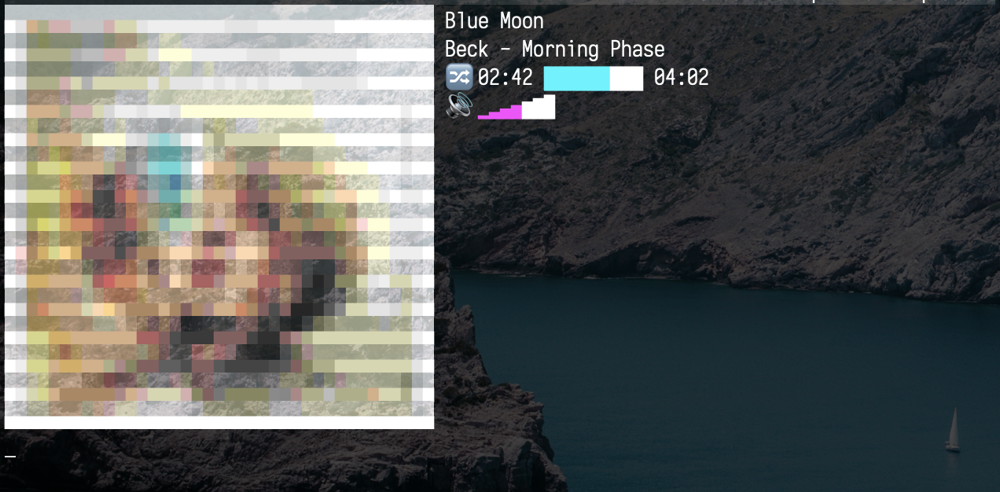

# Apple Music TUI

*Tested on macOS 12 (likely to work on macOS 10.15, 11). Can be called with bash or zsh. I recommend aliasing am.sh to `alias am=zsh path/to/am.sh`, or moving its three individual functions into your .bashrc or .zshrc.*

## Now Playing (np)



Enjoy a simple "Now Playing" widget from your terminal.  Uses standard Unix tooling/piping, AppleScript for interfacing with Apple Music, and [Viu](https://github.com/atanunq/viu) for displaying the album art images.

Dependencies: [Viu](https://github.com/atanunq/viu), [Doug's album-art.applescript](https://dougscripts.com/itunes/2014/10/save-current-tracks-artwork/)

Configuration: 

* Place Doug's album-art.applescript at ~/Library/Scripts/album-art.applescript, or configure a valid path in the np() func of am.sh for wherever you decide to keep it
* (Optional) In the np() func of am.sh, adjust the `-h` dimension of the album art (look for the two calls to `viu`) to ensure a square appearance with your terminal emulator's line spacing

Usage: `am np` (pressing `s` at any time will toggle shuffle)

Notes: 
* A song must be actively playing or paused for it to launch
* Scrubbing, pausing, resuming, as well as navigating forward and backward in the queue can already be accomplished with the special function keys / touch bar, so I did not see a good reason to map keys to additional AppleScript snippets as I did for toggling shuffle

## List

List out all song groupings of a specific type or all songs of a specific song grouping in your library.  The song grouping type is dictated by the flag you pass. By calling list without specifying a title after the flag, you will see a printout of all the titles of that flag's collection type. 

Usage: `am list [-grouping] [name]`
```
  list -s               List all songs in your library.
  list -r               List all records.
  list -r PATTERN       List all songs in the record PATTERN.
  list -a               List all artists.
  list -a PATTERN       List all songs by the artist PATTERN.
  list -p               List all playlists.
  list -p PATTERN       List all songs in the playlist PATTERN.
  list -g               List all genres.
  list -g PATTERN       List all songs in the genre PATTERN.
```
Example: `am list -a In Rainbows` (not case-sensitive)

Notes: 
* Music.app does not need to be open or closed; it should launch itself silently when `list` is called
* Only works on tracks saved to your Library (but they do not need to be downloaded)
* Remember to escape any special characters or punctuation if passing a title (or wrap it in double quotes)

## Play

Begin playback of different song groupings or a specific song grouping in your library. The song grouping type is dictated by the flag you pass.  By calling play without specifying a title after the flag, you are prompted to select a title of that flag's collection type on the fly via [fzf](https://github.com/junegunn/fzf). Unfortunately there is no simple way to play, for example, a specific album or songs from a specific artist with AppleScript, but I was able to modify code shared by a "jccc" [here](https://discussions.apple.com/thread/1053355), as a workaround which involves automatically creating a single temporary playlist in your library that is utilized by play().

Dependencies: [fzf](https://github.com/junegunn/fzf) (unless you always play groupings by name)

Usage: `am play [-grouping] [name]`
```
  play -s               Fzf for a song and begin playback.
  play -s PATTERN       Play the song PATTERN.
  play -r               Fzf for a record and begin playback.
  play -r PATTERN       Play from the record PATTERN.
  play -a               Fzf for an artist and begin playback.
  play -a PATTERN       Play from the artist PATTERN.
  play -p               Fzf for a playlist and begin playback.
  play -p PATTERN       Play from the playlist PATTERN.
  play -g               Fzf for a genre and begin playback.
  play -g PATTERN       Play from the genre PATTERN.
  play -l               Play from your entire library.
```
Example: `am play -a In Rainbows` (not case-sensitive)

Notes: 
* Music.app does not need to be open or closed; it should launch itself silently when `play` is called
* Only works on tracks saved to your Library (but they do not need to be downloaded)
* Remember to escape any special characters or punctuation if passing a title (or wrap it in double quotes)
* calling `-p Library` will result in quite a delay, unlike `-l`, because it requires copying all the songs in your library into the temporary playlist

### Optional AirPlay Snippet (not in src)

Toggle the Music.app AirPlay audio output for a specific device. 

Configuration: 
* Adjust the device strings to a device hostname of your choosing
* Ideally adapt the argument name to match

```
if [ $1 = "atv" ]
   then
    isActive=$(osascript -e 'tell application "Music" to get selected of AirPlay device "Apple TV"')
    if [ $isActive = 'false' ]
    then
      osascript -e 'tell application "Music" to set selected of AirPlay device "Apple TV" to true'
    else
      osascript -e 'tell application "Music" to set selected of AirPlay device "Apple TV" to false'
  fi
fi
```
Example: `zsh ap.sh atv`

### Known Problems

Error: `execution error: Music got an error: Application isn’t running. (-600)`

Solution: Reboot. It seems to occur occasionally after having had Music.app open for too long while your Mac has slept. Other potential solutions can be found [here](https://stackoverflow.com/questions/19957268/applescript-fails-with-error-600-when-launched-over-ssh-on-mavericks)

### Ideas For Improvement

* am.sh could be expanded with a function to call new AppleScript snippets to create, delete, or refine playlists
* See the Script Editor.app's dictionary API (Music.sdef) for an exhaustive reference of all the Music.app variables and functions that can be interfaced via AppleScript
